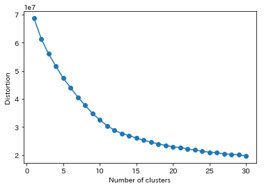

# kmeans-elbow-chart-processed-parallelly
It is often time-consuming to plot an elbow chart of kmeans with large k.

In this repository I'll show you how to proccess this task parallelly with scikit-learn.

The figure below is a sample.

